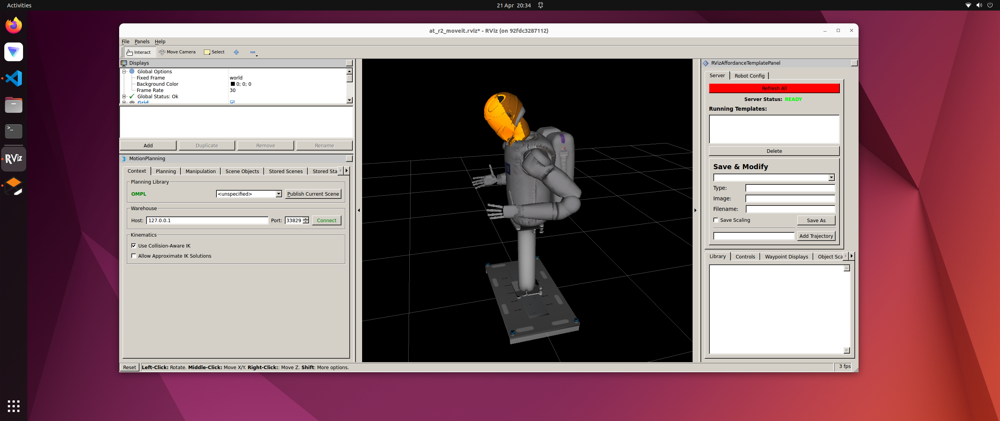
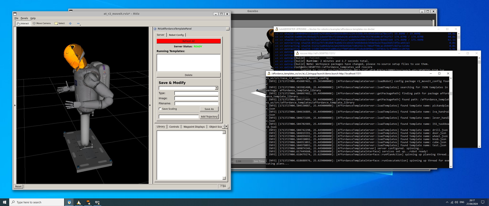

# Docker for Robotics with the Robot Operating System (ROS/ROS 2)

Author: [Tobit Flatscher](https://github.com/2b-t) (2021 - 2024)

[](https://github.com/2b-t/docker-for-ros/actions/workflows/build-ros.yml) [](https://github.com/2b-t/docker-for-ros/actions/workflows/build-ros2.yml) [](https://opensource.org/licenses/MIT)


## Overview

This guide discusses best practices for **robotics development with the [Robot Operating System (ROS/ROS 2)](https://www.ros.org/) and Docker/Docker-Compose** on **Linux** as well as **Windows** operating systems. This includes displaying **graphic user interfaces**, working with hardware, **real-time capable code** and the **network set-up** for multiple machines. Additionally it walks you through the **set-up with Visual Studio Code**.

This repository used to be part of [another guide](https://github.com/2b-t/docker-realtime) I have written on Docker and real-time applications. As the general Docker and ROS part has now become quite lengthy, I have decided to extract it and create a repository of its own for it.

|  |  |
| ------------------------------------------------------------ | ------------------------------------------------------------ |
| ROS Indigo running from a Docker container on Ubuntu 22.04   | ROS Indigo running from a Docker container on Windows 10 with WSL2 |


## Structure of this guide

This guide is structured in the following chapters:

- [**Motivation**](./doc/Motivation.md): Tries to give you good reasons for why you should use Docker as a company or research institution.
- [**Introduction to Docker and Docker-Compose**](./doc/Introduction.md): Introduces fundamental concepts of container-based development.
- [**Set-up with Visual Studio Code**](./doc/VisualStudioCodeSetup.md): Walks you through the set-up of containers with Visual Studio Code.
- [**Graphic user interfaces and Docker**](./doc/Gui.md): Discusses the challenges of using Docker with graphic user interfaces and presents workarounds.
- [**ROS and Docker**](./doc/Ros.md): Discusses best-practices for Docker and ROS/ROS 2.
- [**Docker on Windows**](./doc/Windows.md): Running Docker on Windows in WSL2 with graphic user interfaces.
- [**Working with hardware**](./doc/WorkingWithHardware.md): Discusses best-practices when working with hardware.

The folder [**`examples/`**](./examples) contains different ROS and ROS 2 examples (in simulation as well as with hardware access) while the folder  [**`templates/`**](./templates) provides templates for ROS and ROS 2 that you can build your own workspace off. This guide is further extended by an external guide on **Docker for real-time applications with `PREEMPT_RT`** that can be found [here](https://github.com/2b-t/docker-realtime).

 

## Get a copy

This workspace contains several other repositories as submodules. Therefore please clone it with the following command:

```bash
$ git clone --recurse-submodules https://github.com/2b-t/docker-for-ros.git
```
