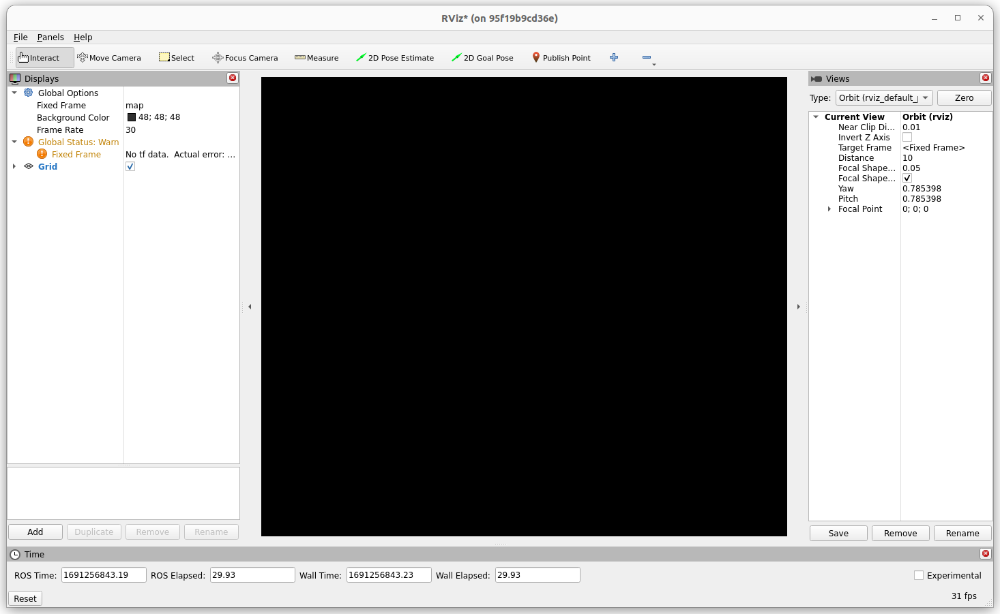

# Graphic user interfaces inside Docker

Author: [Tobit Flatscher](https://github.com/2b-t) (2021 - 2023)


## 1. Different approaches 

Running user interfaces from inside a Docker might not be its intended usage but as of now there are several options available. The problem with all of them is that most of them are specific to Linux operating systems. On the the [ROS Wiki](http://wiki.ros.org/docker/Tutorials/GUI) the different options are discussed in more detail:

- In Linux there are several ways of connecting a containers output to a host's **X server** resulting in an output which is indistinguishable from a program running on the host directly. This is the approach chosen for this guide. It is quite portable but requires additional steps for graphics cards running with nVidia hardware acceleration rather than the Linux Nouveau display driver. OSRF has also released [Rocker](https://github.com/osrf/rocker) as a tool to support mounting folders and launching graphic user interfaces. I did not use it as I try to avoid introducing unnecessary dependencies.
- Other common approaches are less elegant and often use some sort of **Virtual Network Computing (VNC)** which streams the entire desktop to the host over a dedicated window similar to connecting virtually to a remote machine. This is usually the approach chosen for other operating systems such as Windows and Macintosh but requires additional software and does not integrate as seemlessly.

The rest of the guide will focus on graphic user interfaces on Linux by exploiting X-Server. This won't work with Windows and Mac but I would not encourage using Docker on other operating systems other than Linux anyways.


## 2. Using X-Server

As pointed out before this guide uses the Ubuntu X-Server for outputting dialogs from a Docker. The Docker-Compose file with and without Nvidia hardware acceleration look differently and Nvidia hardware acceleration requires a few additional setup steps. These differences are briefly outlined in the sections below. It is worth mentioning that **just having an Nvidia card does not necessitate the Nvidia setup** but instead what matters is the **driver** used for the graphics card. If you are using a Nouveau driver for an Nvidia card then a Docker-Compose file written for hardware acceleration won't work and instead you will have to turn to the Docker-Compose file without it. And vice versa, if your card is managed by the Nvidia driver then the first approach won't work for you. This fact is in particular important for the `PREEMPT_RT` patch: You won't be able to use your Nvidia driver when running the patch. Your operating system might mistakenly tell you that it is using the Nvidia driver but it might not. It is therefore important to check the output of `$ nvidia-smi`. If it outputs a managed graphics card, then you will have to go for the second approach with hardware acceleration. If it does not output anything or is not even installed go for the Nouveau driver setup.

You can check in Software and Updates which graphics driver is currently used:


In any case before being able to **stream to the X-Server on the host system** you will have to run the following command inside the **host system**:

```bash
$ xhost +local:root
```

where `root` corresponds to the user-name of the user used inside the Docker container. This command has to be **repeated after each restart** of the host system.

If you do not execute this command before launching a graphic user interface the application will not be able to connect to the display. For Rviz for example this might look as follows:

```bash
$ root@P500:/ros_ws# rosrun rviz rviz
Authorization required, but no authorization protocol specified
qt.qpa.xcb: could not connect to display :0
qt.qpa.plugin: Could not load the Qt platform plugin "xcb" in "" even though it was found.
This application failed to start because no Qt platform plugin could be initialized. Reinstalling the application may fix this problem.

Available platform plugins are: eglfs, linuxfb, minimal, minimalegl, offscreen, vnc, xcb.

Aborted (core dumped)
```


### 2.1 Nouveau and AMD driver

As pointed out in the second before this type of setup applies to any card that is not managed by an Nvidia driver, even if the card is an Nvidia card. In such a case it is sufficient to share the following few folders with the host system. The `docker-compose.yml` might look as follows:

```yaml
version: "3.9"
services:
  some_name:
    build:
      context: .
      dockerfile: Dockerfile
    tty: true
    environment:
     - DISPLAY=${DISPLAY} # Option for sharing the display
     - QT_X11_NO_MITSHM=1 # For Qt
    volumes:
      - /tmp/.X11-unix:/tmp/.X11-unix:rw # Share system folder
      - /tmp/.docker.xauth:/tmp/.docker.xauth:rw # Share system folder
```

### 2.2 Hardware acceleration with Nvidia cards

This section is only relevant for Nvidia graphic cards managed by the Nvidia driver or if you want to have hardware acceleration inside the Docker, e.g. for using CUDA or OpenGL. Graphic user interfaces that do not require it will work fine in any case. As also pointed out [in the ROS tutorial](http://wiki.ros.org/docker/Tutorials/Hardware%20Acceleration) having hardware acceleration is actually more tricky! Nvidia offers a dedicated [`nvidia-docker`](https://github.com/NVIDIA/nvidia-docker) (with two different options `nvidia-docker-1` and `nvidia-docker-2` which sightly differ) as well as the [`nvidia-container-runtime`](https://nvidia.github.io/nvidia-container-runtime/). Latter was chosen for this guide as it seems to be the way from now onwards and will be discussed below.

#### 2.2.1 Installing the `nvidia-container-runtime`

The installation process of the [`nvidia-container-runtime`](https://nvidia.github.io/nvidia-container-runtime/) is described [here](https://stackoverflow.com/a/59008360). Before following through with the installation make sure it is not already set-up on your system. For this check the `runtime` field from the output of `$ docker info`. If `nvidia` is available as an option already you should be already good to go.

If it is not available you should be able to install it with the following steps:

```bash
$ curl -s -L https://nvidia.github.io/nvidia-container-runtime/gpgkey | \
  sudo apt-key add -
$ distribution=$(. /etc/os-release;echo $ID$VERSION_ID)
$ curl -s -L https://nvidia.github.io/nvidia-container-runtime/$distribution/nvidia-container-runtime.list | \
  sudo tee /etc/apt/sources.list.d/nvidia-container-runtime.list
$ sudo apt-get update
$ sudo apt-get install nvidia-container-runtime
```

and then [set-up the Docker runtime](https://github.com/NVIDIA/nvidia-container-runtime#docker-engine-setup):

```bash
$ sudo tee /etc/docker/daemon.json <<EOF
{
    "runtimes": {
        "nvidia": {
            "path": "/usr/bin/nvidia-container-runtime",
            "runtimeArgs": []
        }
    }
}
EOF
$ sudo pkill -SIGHUP dockerd
```

After these steps you might will have to restart the system or at least the Docker daemon with `$ sudo systemctl daemon-reload` and `$ sudo systemctl restart docker`. Then `$ docker info` should output at least two different runtimes, the default `runc` as well as `nvidia`. This runtime can be set in the Docker-Compose file and one might have to set the `environment variables` `NVIDIA_VISIBLE_DEVICES=all` and `NVIDIA_DRIVER_CAPABILITIES=all`. Be aware that this will fail when launching it on other system without that runtime. You will need another dedicated Docker-Compose file for non-nVidia graphic cards!

A Docker-Compose configuration for the Nvidia graphics cards with the Nvidia graphics driver looks as follows:

```yaml
version: "3.9"
services:
  some_name:
    build:
      context: .
      dockerfile: Dockerfile
    tty: true
    environment:
     - DISPLAY=${DISPLAY}
     - QT_X11_NO_MITSHM=1
     - NVIDIA_VISIBLE_DEVICES=all # Share devices of host system
     - NVIDIA_DRIVER_CAPABILITIES=all # This allows the guest system to use the GPU also for visualization
    runtime: nvidia # Specify runtime for container
    volumes:
      - /tmp/.X11-unix:/tmp/.X11-unix:rw
      - /tmp/.docker.xauth:/tmp/.docker.xauth:rw
```

Depending on how your system is configured your computer might still decide to use the integrated Intel Graphics instead of your Nvidia card in order to save power. In this case I'd recommend you to switch the Nvidia X Server (that is automatically installed with the driver) to performance mode instead of on-demand as shown in the screenshot below. This way the Nvidia card should always be used instead of the Intel Graphics.


#### 2.2.2 Testing the graphic acceleration inside your container

After following above steps **make sure that inside your container you can use `nvidia-smi`** and it finds your card:

```bash
$ nvidia-smi
Wed Jun 21 00:01:46 2023       
+---------------------------------------------------------------------------------------+
| NVIDIA-SMI 530.41.03              Driver Version: 530.41.03    CUDA Version: 12.1     |
|-----------------------------------------+----------------------+----------------------+
| GPU  Name                  Persistence-M| Bus-Id        Disp.A | Volatile Uncorr. ECC |
| Fan  Temp  Perf            Pwr:Usage/Cap|         Memory-Usage | GPU-Util  Compute M. |
|                                         |                      |               MIG M. |
|=========================================+======================+======================|
|   0  Quadro K2200                    Off| 00000000:03:00.0  On |                  N/A |
| 42%   39C    P8                1W /  39W|    430MiB /  4096MiB |     10%      Default |
|                                         |                      |                  N/A |
+-----------------------------------------+----------------------+----------------------+
                                                                                         
+---------------------------------------------------------------------------------------+
| Processes:                                                                            |
|  GPU   GI   CI        PID   Type   Process name                            GPU Memory |
|        ID   ID                                                             Usage      |
|=======================================================================================|
+---------------------------------------------------------------------------------------+
```

In case the command is not recognized, make sure that you can run it successfully outside the Docker. In case it does not even work outside the Nvidia driver you are currently using is likely incompatible with your graphics card. In case it just does not work inside the Docker likely you made a mistake in your Docker-Compose file.

Just seeing the card with `nvidia-smi` is though not sufficient. If you do not **set the environment variable `NVIDIA_DRIVER_CAPABILITIES`**, e.g. to `NVIDIA_DRIVER_CAPABILITIES=graphics,utility,compute` or **`NVIDIA_DRIVER_CAPABILITIES=all`** the graphic acceleration will not work properly.

For testing if the graphic acceleration actually works inside the Docker you can use the **`glxgears`** application. Install it with

```bash
$ sudo apt-get install mesa-utils
```

on your host system as well as inside the container and compare the two.

Then run it with

```bash
$ glxgears -info
```

This should visualize the following window and output the following information:


```
GL_RENDERER   = Quadro K2200/PCIe/SSE2
GL_VERSION    = 4.6.0 NVIDIA 530.41.03
GL_VENDOR     = NVIDIA Corporation
```

as well as the current frames per second `8579 frames in 5.0 seconds = 1715.776 FPS` every couple of seconds. On a laptop with an additional integrated graphics card this already should tell you which of the two, the dedicated or the integrated one, is being used.

In case you did not set `NVIDIA_DRIVER_CAPABILITIES` inside the container the output from `glxgears` will look as follows and you might observe stuttering in applications such as Gazebo:

```
GL_RENDERER   = llvmpipe (LLVM 12.0.0, 256 bits)
GL_VERSION    = 3.1 Mesa 21.2.6
GL_VENDOR     = Mesa/X.org
```


#### 2.2.3 Hybrid graphics cards and power management

On computers with an integrated graphics card (e.g. notebooks), you might run into issues where graphic acceleration might not work as power management will choose the integrated graphics card over the dedicated one. Run [`$ prime-select query`](https://github.com/linuxmint/nvidia-prime/blob/master/prime-select) to see what the output is (`nvidia`, `intel` or `on-demand`). Depending on the output the open-source or Nvidia version of libGL will be used. You can switch between them by executing `$ prime-select nvidia`. Similarly you can output the available graphic processors with `$ xrandr --listproviders`. In case you have an integrated and dedicated graphic card there should be two entries: `0` and `1` where the order depends on the setting of `prime-select`.

You should be able to switch between the two with [**PRIME offloading**](https://wiki.archlinux.org/title/PRIME). Defining the environment variable `DRI_PRIME` allows you to use the discrete graphics card  e.g. `DRI_PRIME=1 glxinfo`. Similarly Nvidia exposes the environment variable [`__NV_PRIME_RENDER_OFFLOAD`](https://download.nvidia.com/XFree86/Linux-x86_64/435.17/README/primerenderoffload.html) for this purpose, e.g. `$ __NV_PRIME_RENDER_OFFLOAD=1 __GLX_VENDOR_LIBRARY_NAME=nvidia glxinfo`. Finally you can use `prime-run` to force a program to offload to the dedicated Nvidia GPU:

```bash
$ prime-run some_program
```


### 2.3 Avoiding duplicate configurations

You can already see that there are quite a few common options between the two configurations. While sadly Docker-Compose does not have conditional execution (yet) one might [override or extend an existing configuration file](https://github.com/Yelp/docker-compose/blob/master/docs/extends.md) (see also [`extends`](https://docs.docker.com/compose/extends/) as well this [Visual Studio Code guide](https://code.visualstudio.com/docs/remote/create-dev-container#_extend-your-docker-compose-file-for-development)).

I normally start by creating a base Docker-Compose file `docker-compose.yml` that does not support graphic cards

```yaml
version: "3.9"
services:
  some_name:
    build:
      context: .
      dockerfile: Dockerfile
    tty: true
```

that is then extended for graphic user interfaces without Nvidia driver `docker-compose-gui.yml`,

```yaml
version: "3.9"
services:
  some_name:
    extends:
      file: docker-compose.yml
      service: some_name
    environment:
     - DISPLAY=${DISPLAY}
     - QT_X11_NO_MITSHM=1
    volumes:
      - /tmp/.X11-unix:/tmp/.X11-unix:rw
      - /tmp/.docker.xauth:/tmp/.docker.xauth:rw
```

on top of that goes another Docker-Compose file with Nvidia acceleration `docker-compose-gui-nvidia.yml`

```yaml
version: "3.9"
services:
  some_name:
    extends:
      file: docker-compose-gui.yml
      service: some_name
    environment:
     - NVIDIA_VISIBLE_DEVICES=all
     - NVIDIA_DRIVER_CAPABILITIES=all
    runtime: nvidia
```

and finally I have yet another file which can be launched for hardware acceleration without graphic user interfaces `docker-compose-nvidia.yml` which might be used for computations and machine learning containers.

```yaml
version: "3.9"
services:
  some_name:
    extends:
      file: docker-compose.yml
      service: some_name
    environment:
     - NVIDIA_VISIBLE_DEVICES=all
    runtime: nvidia
```

This way if I need to add additional options, I only have to modify the base Docker-Compose file `docker-compose.yml` and the others will simply adapt.

I can then specify which file should be launched to Docker-Compose with e.g.

```bash
$ docker-compose -f docker-compose-gui-nvidia.yml up
```


### 2.4 Known issues

In certain versions of Linux you might run into the problem that **certain applications using hardware acceleration (e.g. Rviz and Gazebo) might not be displayed correctly**, instead black windows are displayed similar to the screenshot below:

 

This is a [known bug in the Mesa implementation of OpenGL present on e.g. Ubuntu 22.04](https://github.com/ros2/rviz/issues/948#issuecomment-1427569107) and can be resolved by **upgrading  Mesa or by switching to Nvidia's implementation by using the Nvidia container runtime** (in case you have an Nvidia grapics card).

The update can be performed by running the following commands inside the Docker container

```bash
$ apt-get install software-properties-common
$ add-apt-repository ppa:kisak/kisak-mesa
$ apt-get update
$ apt-get upgrade
```

or by adding an additional layer to your Dockerfile:

```dockerfile
RUN apt-get update \
 && apt-get install -y \
    install software-properties-common \
 && add-apt-repository ppa:kisak/kisak-mesa \
 && apt-get update \
 && apt-get upgrade -y \
 && rm -rf /var/lib/apt/lists/*
```


