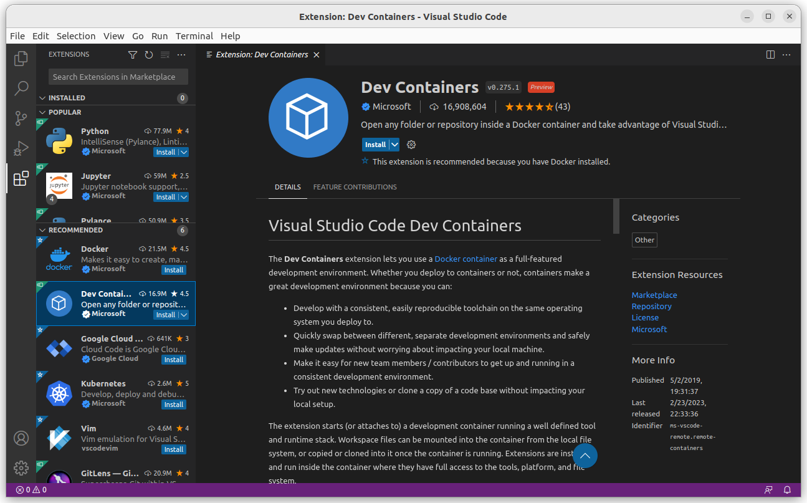
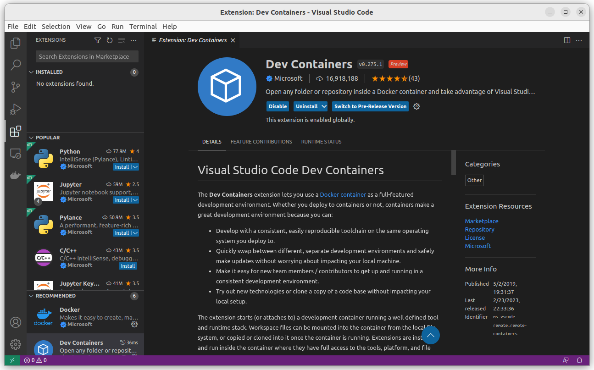
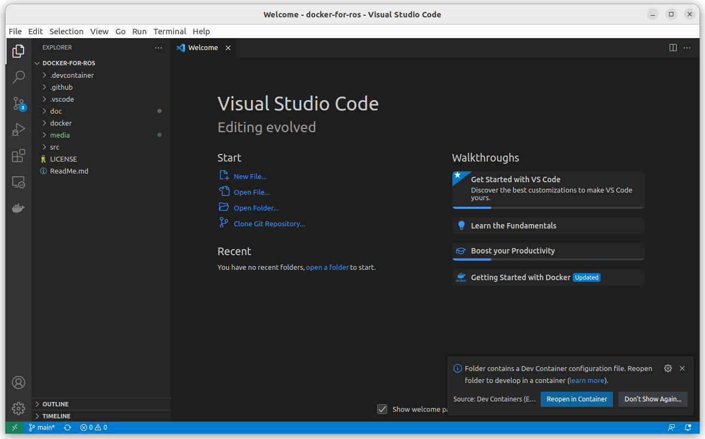
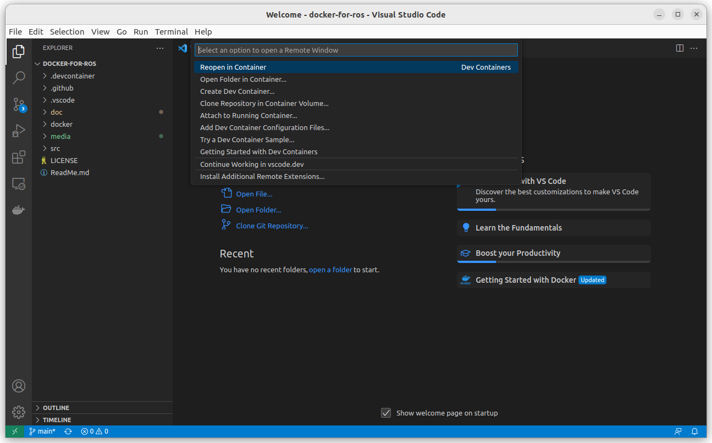
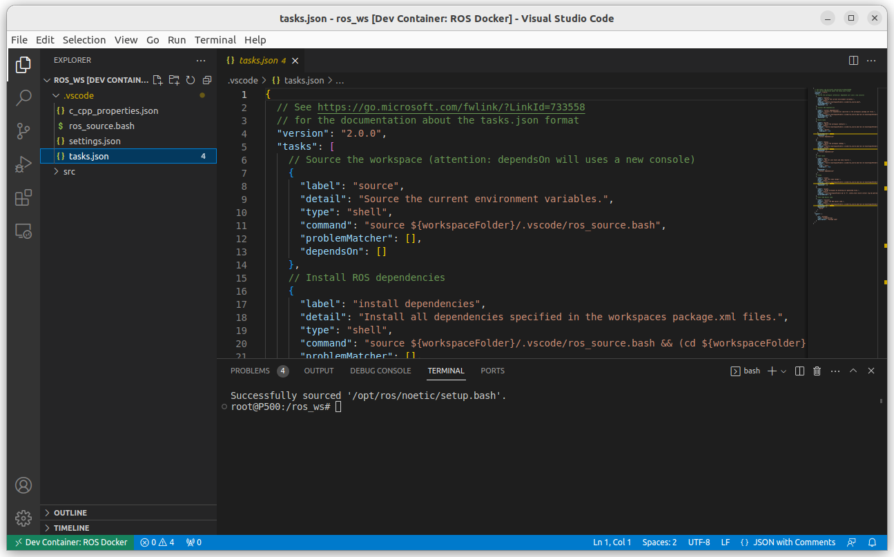

# Docker and Visual Studio Code

Author: [Tobit Flatscher](https://github.com/2b-t) (August 2021 - February 2023)


## 1. Docker in Visual Studio Code

The following guide will walk you through the set-up for Docker inside Visual Studio Code. The integration with Visual Studio Code is excellent. I can only warmly recommend it for working with Visual Studio Code.

### 1.1 Installation

If you do not have Visual Studio Code installed on your system then [install it](https://code.visualstudio.com/download) and follow the Docker post-installation steps given [here](https://docs.docker.com/engine/install/linux-postinstall/) so that you can run Docker without `sudo`. Finally install [Docker](https://marketplace.visualstudio.com/items?itemName=ms-azuretools.vscode-docker) and [**Remote - Containers**](https://marketplace.visualstudio.com/items?itemName=ms-vscode-remote.remote-containers) plugins inside Visual Studio Code and you should be ready to go. For installing the Remote Containers plug-in go the market place through the activity bar, browse the plug-in and install it as displayed in the screenshot below:



After the successful installation you should see a small **green icon on the bottom left of your window** as displayed in the following screenshot:



### 1.2 Configuration

Visual Studio Code generates two folders for your project, one called `.devcontainer` contains the Docker settings while the other, `.vscode`, contains the Visual Studio code preferences:

```
repository
├─ .devcontainer # Docker settings
|  └─ devcontainer.json
└─ .vscode
```

The `.devcontainer` file let's Visual Studio Code know if it is dealing with [Docker](https://github.com/athackst/vscode_ros2_workspace/blob/foxy/.devcontainer/devcontainer.json) or [Docker Compose](https://github.com/devrt/ros-devcontainer-vscode/blob/master/.devcontainer/devcontainer.json). The contents of the Json configuration file `.devcontainer/devcontainers.json` might look as follows:

```json
{
  "name": "ROS Docker",
  "dockerComposeFile": [
    "../docker/docker-compose.yml"
  ],
  "service": "ros_docker",
	"workspaceFolder": "/benchmark",
  "shutdownAction": "stopCompose",
  "extensions": [
  ]
}
```

The contents of `.vscode` depend on the programming language and the additional plug-ins you want to use, e.g. for Linting/static code analysis. One can configure for example tasks that can be executed with key shortcuts.

In my case I have configured the following tasks inside my `tasks.json`:

```json
{
  // See https://go.microsoft.com/fwlink/?LinkId=733558
  // for the documentation about the tasks.json format
  "version": "2.0.0",
  "tasks": [
    // Source the workspace (attention: dependsOn will uses a new console)
    {
      "label": "source",
      "detail": "Source the current environment variables.",
      "type": "shell",
      "command": "source ${workspaceFolder}/.vscode/ros_source.bash",
      "problemMatcher": [],
      "dependsOn": []
    },
    // Install ROS dependencies
    {
      "label": "install dependencies",
      "detail": "Install all dependencies specified in the workspaces package.xml files.",
      "type": "shell",
      "command": "source ${workspaceFolder}/.vscode/ros_source.bash && (cd ${workspaceFolder} && sudo apt-get update && rosdep update && rosdep install --from-paths src --ignore-src -y)",
      "problemMatcher": [],
      "dependsOn": []
    },
    // Build tasks
    {
      "label": "build",
      "detail": "Build the workspace (default).",
      "type": "shell",
      "command": "source ${workspaceFolder}/.vscode/ros_source.bash && (cd ${workspaceFolder} && catkin build --cmake-args '-DCMAKE_BUILD_TYPE=Release' -Wall -Wextra -Wpedantic)",
      "group": {
        "kind": "build",
        "isDefault": true
      },
      "problemMatcher": "$gcc",
      "dependsOn": [
        "install dependencies"
      ]
    },
    {
      "label": "debug",
      "detail": "Build the workspace (debug).",
      "type": "shell",
      "command": "source ${workspaceFolder}/.vscode/ros_source.bash && (cd ${workspaceFolder} && catkin build --cmake-args '-DCMAKE_BUILD_TYPE=Debug' -Wall -Wextra -Wpedantic)",
      "group": "build",
      "problemMatcher": "$gcc",
      "dependsOn": [
        "install dependencies"
      ]
    },
    // Test tasks
    {
      "label": "test",
      "detail": "Run all unit tests and show results.",
      "type": "shell",
      "command": "source ${workspaceFolder}/.vscode/ros_source.bash && (cd ${workspaceFolder} && catkin run_tests)",
      "group": {
        "kind": "test",
        "isDefault": true
      },
      "dependsOn": [
        "install dependencies"
      ]
    },
    // Clean
    {
      "label": "clean",
      "detail": "Run the clean target.",
      "type": "shell",
      "command": "source ${workspaceFolder}/.vscode/ros_source.bash && (cd ${workspaceFolder} && catkin clean --yes)",
      "problemMatcher": "$gcc",
      "dependsOn": []
    },
    {
      "label": "purge",
      "detail": "Purge workspace by deleting all generated files.",
      "type": "shell",
      "command": "(cd ${workspaceFolder} && rm -fr .catkin_tools build install log && py3clean .)",
      "problemMatcher": []
    },
    // Start ROS Master node
    {
      "label": "roscore",
      "detail": "Start the ROS master node.",
      "type": "shell",
      "command": "source ${workspaceFolder}/.vscode/ros_source.bash && (cd ${workspaceFolder} && roscore)",
      "problemMatcher": "$gcc",
      "dependsOn": [
        "build"
      ]
    },
  ],
  "inputs": [
    {
      "id": "package",
      "type": "promptString",
      "description": "Package name"
    }
  ]
}
```


### 1.3 Usage

After opening Visual Studio Code you can open the repository with **`File/Open Folder`**. When asked if you want to **`Reopen in container`** (see the left screenshot below) confirm. If this dialog does not appear click on the green symbol on the very left bottom of your window and select `Remote containers: Reopen in container` from the top center as shown in the bottom right picture). Depending on how many layers the Docker has, if they are already pre-cached and how good your internet connection is, it might take seconds or minutes to prepare your container for you.

|  |  |
| ------------------------------------------------------------ | ------------------------------------------------------------ |

In case you are terminated with the error message "Current user does not have permission to run 'docker'. Try adding the user to the 'docker' group." follow the advice given [here](https://stackoverflow.com/questions/57840395/permission-issue-using-remote-development-extension-to-attach-to-a-docker-image). Open a new terminal on your host machine, enter `$ sudo usermod -aG docker $USER`, reboot and then retry opening the container inside Visual Studio Code.

As soon as you have entered the Docker you should be greeted by a terminal inside it and the green icon on the bottom left should state **`Dev Container`**. You can open a new terminal by selecting **`Terminal/New Terminal`** any time. You can now browse the Docker container just like a regular terminal and access the folders inside it as if they were on the host system (see the screenshot below).


