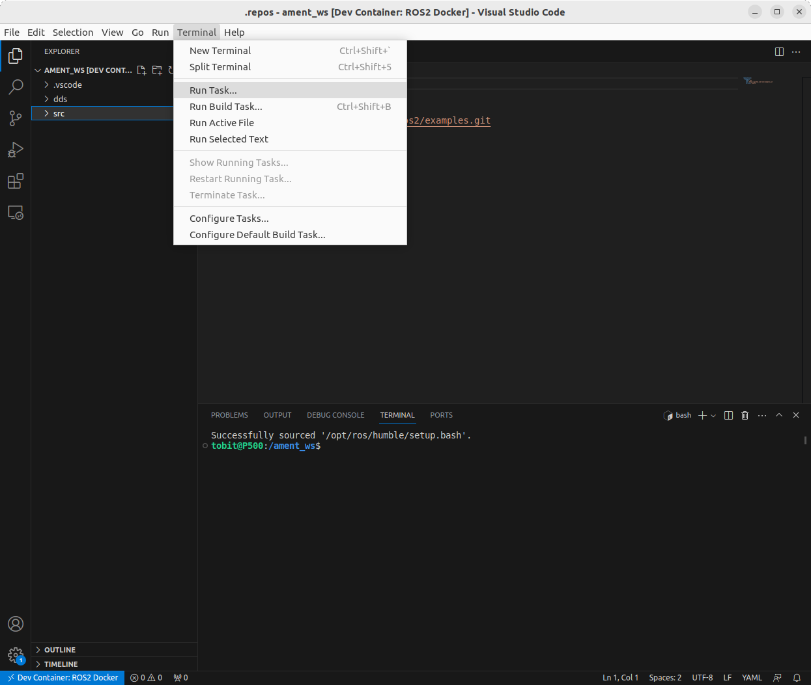
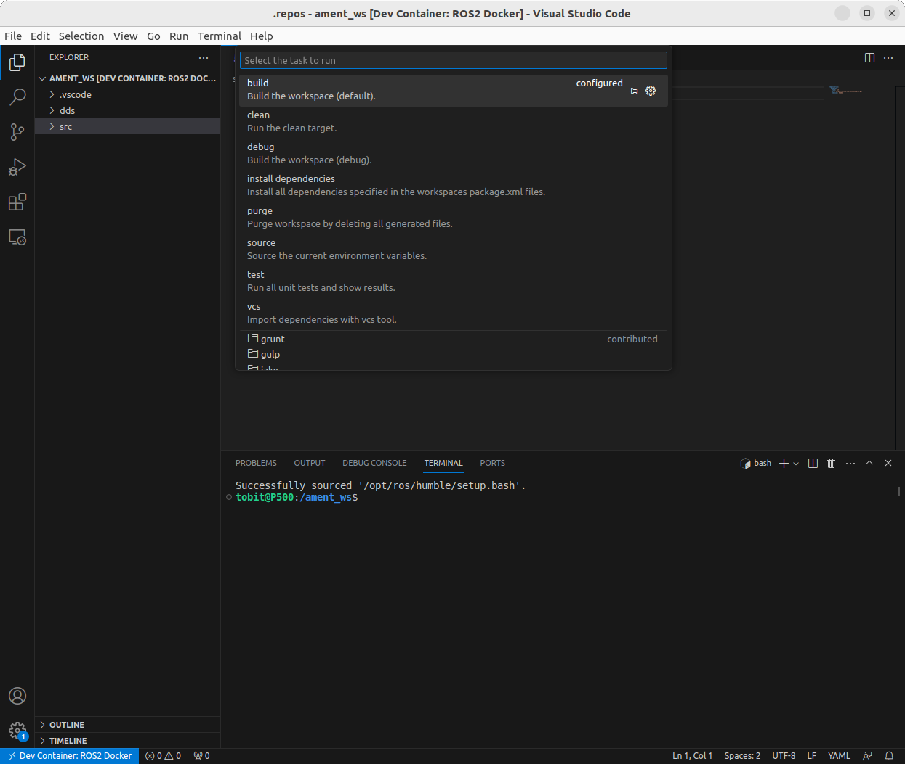

# Docker and Visual Studio Code

Author: [Tobit Flatscher](https://github.com/2b-t) (2021 - 2023)


## 1. Docker in Visual Studio Code

The following guide will walk you through the set-up for Docker inside Visual Studio Code. The integration of Docker with Visual Studio Code is excellent. I can only warmly recommend it for working with Visual Studio Code.

### 1.1 Installation

If you do not have Visual Studio Code installed on your system then [install it](https://code.visualstudio.com/download) and follow the Docker post-installation steps given [here](https://docs.docker.com/engine/install/linux-postinstall/) so that you can run Docker without `sudo`. Finally install [Docker](https://marketplace.visualstudio.com/items?itemName=ms-azuretools.vscode-docker) and [**Remote - Containers**](https://marketplace.visualstudio.com/items?itemName=ms-vscode-remote.remote-containers) plugins inside Visual Studio Code and you should be ready to go. For installing the Remote Containers plug-in go the market place through the activity bar, browse the plug-in and install it as displayed in the screenshot below:


After the successful installation you should see a small **green icon on the bottom left of your window** as displayed in the following screenshot:


### 1.2 Configuration

Visual Studio Code generates two folders for your project, one called **`.devcontainer`** contains the Docker settings while the other, **`.vscode`**, contains the Visual Studio code preferences:

```
repository
├─ .devcontainer # Docker settings
|  └─ devcontainer.json
└─ .vscode
```

#### 1.2.1 Devcontainer configuration

The `.devcontainer` file let's Visual Studio Code know if it is dealing with [Docker](https://github.com/athackst/vscode_ros2_workspace/blob/foxy/.devcontainer/devcontainer.json) or [Docker Compose](https://github.com/devrt/ros-devcontainer-vscode/blob/master/.devcontainer/devcontainer.json). The contents of the Json configuration file `.devcontainer/devcontainers.json` might look as follows:

```json
{
  "name": "ROS Docker",
  "dockerComposeFile": [
    "../docker/docker-compose.yml"
  ],
  "service": "ros_docker",
  "workspaceFolder": "/benchmark",
  "shutdownAction": "stopCompose",
  "extensions": [
  ]
}
```

You can also [access local variables on the host system with `${localEnv:SOME_HOST_VAR}`](https://code.visualstudio.com/remote/advancedcontainers/environment-variables).

#### 1.2.2 Configuring tasks

The contents of `.vscode` depend on the programming language and the additional plug-ins you want to use, e.g. for Linting/static code analysis. One can configure for example tasks that can be executed with key shortcuts.

Furthermore you can add a `tasks.json` that defines certain useful tasks that VS Code can run. My configurations for ROS and ROS 2 can be found in the corresponding folders [`/templates/ros/.vscode/tasks.json`](../templates/ros/.vscode/tasks.json) as well as [`/templates/ros2/.vscode/tasks.json`](../templates/ros2/.vscode/tasks.json). I configure tasks for importing repositories with [`vcs`](https://github.com/dirk-thomas/vcstool), installing dependencies with `rosdep`, building a workspace with `catkin` or `colcon`, running tests and finally cleaning the workspace.

You can run these tasks by selecting `Terminal/Run Tasks...` and then selecting the desired task. This will open a subterminal and run this task in the corresponding subterminal.

|  |  |
| ------------------------------------------------------------ | ------------------------------------------------------------ |

### 1.3 Usage

After opening Visual Studio Code you can open the repository with **`File/Open Folder`**. When asked if you want to **`Reopen in container`** (see the left screenshot below) confirm. If this dialog does not appear click on the green symbol on the very left bottom of your window and select `Remote containers: Reopen in container` from the top center as shown in the bottom right picture). Depending on how many layers the Docker has, if they are already pre-cached and how good your internet connection is, it might take seconds or minutes to prepare your container for you.

|  |  |
| ------------------------------------------------------------ | ------------------------------------------------------------ |

In case you are terminated with the error message "Current user does not have permission to run 'docker'. Try adding the user to the 'docker' group." follow the advice given [here](https://stackoverflow.com/questions/57840395/permission-issue-using-remote-development-extension-to-attach-to-a-docker-image). Open a new terminal on your host machine, enter `$ sudo usermod -aG docker $USER`, reboot and then retry opening the container inside Visual Studio Code.

As soon as you have entered the Docker you should be greeted by a terminal inside it and the green icon on the bottom left should state **`Dev Container`**. You can open a new terminal by selecting **`Terminal/New Terminal`** any time. You can now browse the Docker container just like a regular terminal and access the folders inside it as if they were on the host system (see the screenshot below).


In case you want to rebuild the image press **`Ctrl` + `Shift` + `P`**, type Rebuild and then select either **`DevContainers: Rebuild`** or `DevContainers: Rebuild without Cache`. Former will rebuild the image re-using existing layers while the latter will discard all the existing layers and rebuild the image from scratch.

### 1.4 Debugging

It might happen that the Visual Studio Code integration might terminate and does not output much useful information. This might be the case if you are asking it to run a container with the `nvidia-container-runtime` but it is not installed on your system or your `devcontainer.json` mentions the wrong service and/or workspace. Similarly it happened in the past that the Visual Studio Code extension was not compatible with Docker itself. In this case you might have to up- or downgrade the Docker version you are using (see e.g. [here](https://github.com/microsoft/vscode-remote-release/issues/7958)). In case this emerges it is worth **checking the [VSC remote container issues on Github](https://github.com/microsoft/vscode-remote-release/issues)** and trying to **build your image without cache** as described in the section above. If all of this does not work it can be helpful to go back to the **Docker command line commands** and launch them manually to see if there are any issues with the Docker engine itself.
