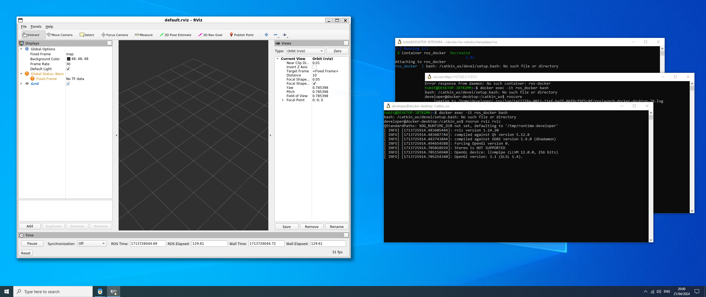

# Docker on Windows

Author: [Tobit Flatscher](https://github.com/2b-t) (2024)


## 0. Overview

Docker can also be installed on Windows (with a WSL 2 backend) as is described in more detail [here](https://docs.docker.com/desktop/install/windows-install/). After installing Docker you can use the `docker` as well as `docker compose` commands from within PowerShell. Currently this standard approach does not allow you though to stream graphic user interfaces to the host system while using WSL directly does.

[Since Windows 10 Build 19044+ or Windows 11 (January 2024) **Windows Subsystem for Linux 2 (WSL2)** supports Linux GUI applications](https://learn.microsoft.com/en-us/windows/wsl/tutorials/gui-apps). This enables us to use Docker in the same way as we do on Ubuntu including our **graphic user interfaces**. If you want to check if your operating system supports it, check the version of your operating system as discussed [here](https://support.microsoft.com/en-us/windows/which-version-of-windows-operating-system-am-i-running-628bec99-476a-2c13-5296-9dd081cdd808). Potentially you will have to follow the following steps to [update](https://support.microsoft.com/en-us/windows/get-the-latest-windows-update-7d20e88c-0568-483a-37bc-c3885390d212) (Windows 10 to the corresponding build version) or [upgrade your operating system](https://support.microsoft.com/en-us/windows/upgrade-to-windows-10-faq-cce52341-7943-594e-72ce-e1cf00382445) (to either Windows 10 or 11). The following paragraphs describe how your Windows 10 or 11 system can then be configured so that you can use graphic user interfaces in the same way as on a Ubuntu system.

As hardware (such as network interfaces) has to be shared between the Windows and the Linux subsystem WSL makes heavy use of virtualization that differs in between WSL and WSL 2 as discussed [here](https://learn.microsoft.com/en-us/windows/wsl/faq#can-wsl-2-use-networking-applications-). This can lead to **problems with hardware** such as e.g. [here](https://github.com/OpenEtherCATsociety/SOEM/issues/630). This makes WSL not very favourable for development or deployment (for ROS 2 it might be better to install it on the host system directly as described [here](https://docs.ros.org/en/humble/Installation/Windows-Install-Binary.html) and run at least the nodes that interface the hardware on the operating system without a container). In my opinion the main use cases for Docker on Windows are therefore the following:

- **Getting started with robotics**: You do not have a Linux system but want to try ROS on your system. WSL allows you to work with ROS as well as ROS 2 at least in **simulation**.
- **Data sharing**: You might need to interact with clients, partner companies and share holders that are either not familiar with Linux or are not allowed to use Linux due to security restructions (most companies strangely enough still allow WSL to be used though). They can then either work in simulation or from recorded ROS bag data.



## 1. Windows Subsystem for Linux (WSL) Configuration

The following paragraph will quickly walk you through the installation of [Windows Subsystem for Linux](https://learn.microsoft.com/en-us/windows/wsl/install) as well as the [Windows Subsystem for Linux GUI (WSLg) extension](https://github.com/microsoft/wslg). The basic steps are listed [here](https://learn.microsoft.com/en-us/windows/wsl/tutorials/gui-apps) but I will elaborate them in more detail. First of all follow the steps to install WSL as outlined [here](https://learn.microsoft.com/en-us/windows/wsl/install). This basically involves opening a PowerShell and either typing `$ wsl --install` or

```powershell
$ wsl --install -d Ubuntu
```

where the distribution `Ubuntu` can be replaced by any of the choices given by `$ wsl --list --online`.

If you already had WSL installed you might need to update it as follows:

```powershell
$ wsl --update
$ wsl --shutdown
```

In the PowerShell check the version of WSL of your subsystem. There are two versions `1` and `2` which are different in a few relevant aspects (as discussed e.g. [here](https://learn.microsoft.com/en-gb/windows/wsl/compare-versions)). Make sure your subsystem is running **version 2** and switch as follows if necessary:

```powershell
$ wsl -l -v
  NAME     STATE     VERSION
* Ubuntu   Running   1
$ wsl —set-version Ubuntu 2
For information on key differences with WSL 2 please visit https://aka.ms/wsl2
Conversion in progress, this may take a few minutes...
The operation completed successfully.
```

You can then open the Windows Subsystem for Linux by searching for **WSL** or Ubuntu inside the installed programs and running it. This will open a terminal that can be used like any other **Linux terminal**.

Inside WSL check the `DISPLAY` variable:

```bash
$ echo $DISPLAY
:0
```

It should be set to `:0`. If it is not, make sure that you are using WSL 2 as discussed above and follow the debugging guide [here](https://github.com/microsoft/wslg/wiki/Diagnosing-%22cannot-open-display%22-type-issues-with-WSLg).

Proceed to install and run any GUI-based program such as `gedit`:

```bash
$ sudo apt install gedit
$ gedit
```

This should bring up the graphic user interface on your host system.

### 1.1 Hardware acceleration

Make sure you have graphics drivers for your graphics card installed. This is not strictly necessary but is useful for hardware acceleration (e.g. OpenGL). The Nvidia drivers can be downloaded [here](https://www.nvidia.com/Download/index.aspx?lang=en-us) by selecting your graphics card and the operating system. To see if the hardware acceleration is working in WSL, launch WSL and make sure that `$ nvidia-smi` detects your graphics card.

## 2. Running Docker with graphic user interfaces inside WSL 2

**Graphic user interfaces in WSL 2 then work in the very same way as on Linux operating systems.** Follow the installation of Docker and Docker-Compose as discussed in [`Introduction.md`](./Introduction.md) as well as the set-up for graphic user interfaces in [`Gui.md`](./Gui.md), including the Nvidia container toolkit in case you want to run hardware acceleration. You can then use the regular `docker` and `docker compose` commands inside the WSL in combination with the templates found in [`templates/`](../templates).

In the figure below you can see the output of running the [Affordance Templates workspace example](../examples/affordance-templates-ros-docker) on a Windows 10 operating system. For this purpose just clone this repository inside the subsystem for Linux

```bash
$ git clone https://github.com/2b-t/docker-for-robotics.git
$ cd docker-for-robotics/examples/affordance-templates-ros-docker
$ docker compose -f docker/docker-compose-gui.yml up
```

Then open another terminal and attach to the container with

```bash
$ docker exec -it affordance_templates bash
```

and there continue to build the workspace and run the main launch file of this example as discussed [here](../examples/affordance-templates-ros-docker/ReadMe.md).


