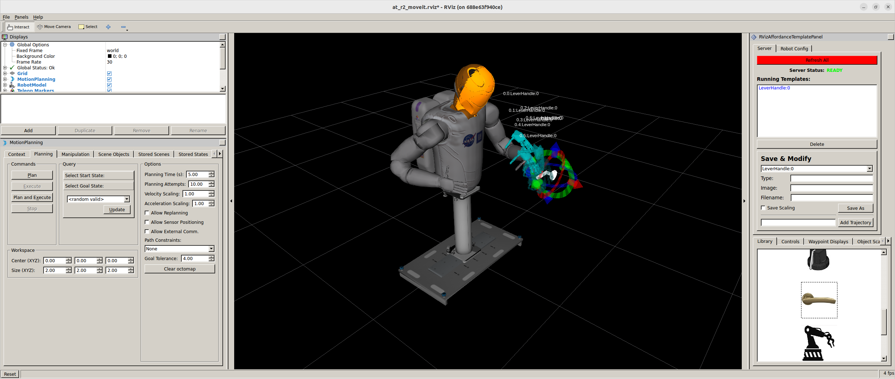

# Example: Affordance templates workspace in ROS Indigo

Author: [Tobit Flatscher](https://github.com/2b-t) (March 2023)


## Overview

Sometimes you come across some interesting old work that you would like to replicate. Sometimes a publication comes with open-source code but likely your ROS version will not necessarily match the one that was used in the publication. For me that was the case when reading the publication about [Affordance Templates](https://www.researchgate.net/publication/283668215_The_Affordance_Template_ROS_package_for_robot_task_programming) published by [Traclabs](https://traclabs.com/projects/affordance-templates/) (you might know them from [trac-ik](https://traclabs.com/projects/trac-ik/)) at [ICRA 2015](https://www.ieee-ras.org/component/rseventspro/event/400-icra-2015-ieee-international-conference-on-robotics-and-automation) (see image below). And even if you had an old computer with [ROS Indigo](http://wiki.ros.org/indigo) (released in 2014!) laying around you would not want to trash that computer with all the dependencies just for trying this one workspace out. This is again where Docker as a technology comes in really handy.



The following example will shows how Docker can be useful for getting legacy code up and running on your machine. This example includes the packages from the [Traclabs Bitbucket](https://bitbucket.org/traclabs/) with the commits specified in [this workspace](https://github.com/yueyeyuniao/affordance_template). Potentially one could also get this workspace up and running in [ROS Fuerte](http://wiki.ros.org/fuerte) by following [this guide](https://bitbucket.org/nasa_ros_pkg/deprecated_misc/wiki/Home) and using the deprecated packages from the NASA Bitbucket ([`nasa_common`](https://bitbucket.org/nasa_ros_pkg/deprecated_nasa_common/src/master/), [`nasa_robodyn`](https://bitbucket.org/nasa_ros_pkg/deprecated_nasa_robodyn/src/master/), [`nasa_r2_simulator`](https://bitbucket.org/nasa_ros_pkg/deprecated_nasa_r2_simulator/src/master/) and [`nasa_r2_common`](https://bitbucket.org/nasa_ros_pkg/deprecated_nasa_r2_common/src/master/)).


## Installation

Please make sure that you cloned this repository with the `--recurse-submodules` option as follows

```bash
$ git clone --recurse-submodules https://github.com/2b-t/docker-for-ros
```

else the modules from Traclabs will be empty. In case you did not you will have to run 

```bash
$ git submodule update --init
```


## Running

Open a terminal on your **host machine** and allow the user `root` to stream onto your display. This way the Docker (which is using `root` as a user) can open graphic user interface on your host machine:

```bash
$ xhost +local:root
```

**Open your Docker** either manually or by using Visual Studio code as described in the main guide. Once inside the Docker perform the following steps:

```bash
$ source /opt/ros/indigo/setup.bash
$ catkin build
$ source devel/setup.bash
$ roslaunch at_r2_bringup demo.launch
```

This should open two new windows, one for the **Gazebo simulation**, the other for the **Rviz visualization** (see screenshot above). The Rviz visualization should contain two panels: The Moveit motion planning panel to the left and the affordance templates panel to the right. Crucial for the latter is the interactive marker that is displayed. Furthermore any object inserted into the scene should be visible from the Asus camera plug-in. 

Inside Moveit you can only plan for the head. To do so select a desired goal state from the section `Query` in the `Planning` tab. Then click `Update` and finally plan and execute the motion with `Plan and Execute`.

The **affordance templates panel** on the right can be used for planning arm motions. As a first step click `Refresh All` in the `Server` tab. This should bring up all the available motion templates in the `Library` tab below. For inserting a new template double click on its icon. This will insert a virtual marker into the scene (if it does not appear make sure that you did not deactivate the interactive marker in the `Displays` panel!). You can adjust the parametrized motion by moving and rotating the interactive marker. This is crucial as the Robonaut will not be able to plan and execute a motion if it is out of reach. Finally in the `Controls` menu you can plan and execute the parametrized motion once inserted: The arrow buttons on the bottom allow you to plan the templates step by step. Click `Execute Plan` to then execute the planned motion. When activating the checkbox `Execute on Plan` stepping the motion will also result in the execution of the plan.
