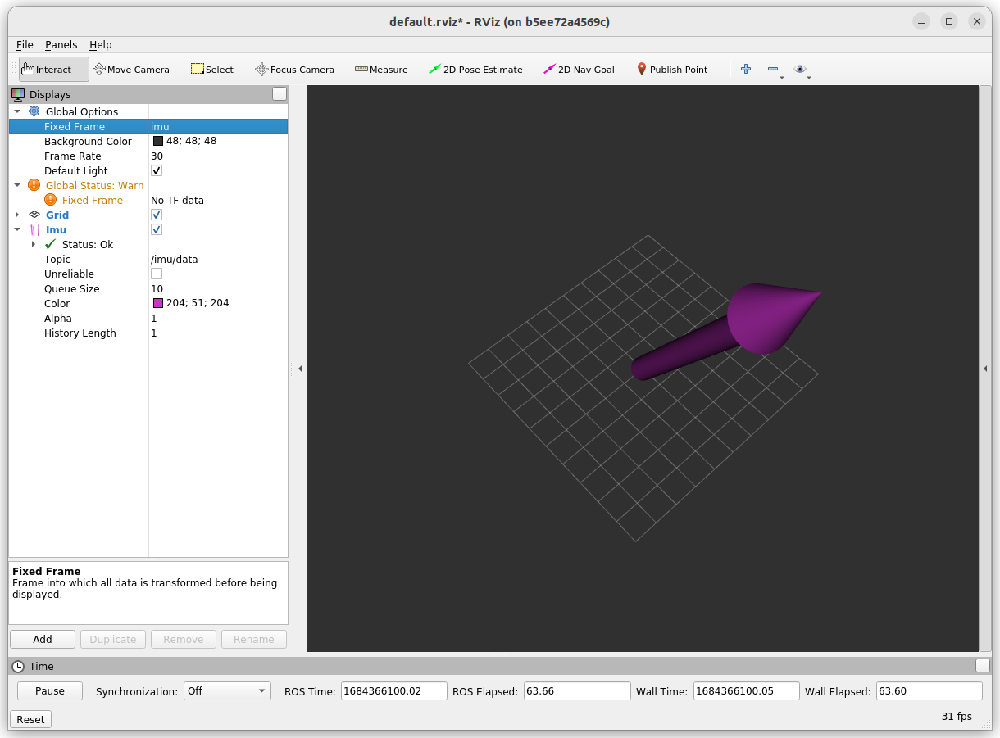

# Docker for LP-Research IMUs

Author: [Tobit Flatscher](https://github.com/2b-t) (May 2023)


## 0. Overview
This repository contains a Docker and all the documentation required to launch a RS232/USB [Life Performance Research IMU](https://www.lp-research.com/lpms-inertial-measurement-unit-imu-series/) connected over USB with the [Robot Operating System ROS](http://wiki.ros.org/noetic). It was tested with a [LPMS-IG1](https://www.lp-research.com/9-axis-imu-with-gps-receiver-series/).

## 1. Creating a Docker
It is then important to mount `/dev` as a volume so that the Docker can access the hardware and allow the Docker to access the corresponding allocated devices by supplying a corresponding [`device_cgroup_rules`](https://access.redhat.com/documentation/en-us/red_hat_enterprise_linux/6/html/resource_management_guide/sec-devices).

In the `docker-compose.yml` this is done with the options:

```yaml
    volumes:
      - /dev:/dev
    device_cgroup_rules:
      - 'c 188:* rmw'
```

## 2. Launching
Allow the container to display contents on your host machine by typing

```bash
$ xhost +local:root
```

Then build the Docker container with

```shell
$ docker compose -f docker-compose-gui.yml build
```
or directly with the [`devcontainer` in Visual Studio Code](https://code.visualstudio.com/docs/devcontainers/containers). For Nvidia graphic cards the file `docker-compose-gui-nvidia.yml` in combination with the [`nvidia-container-runtime`](https://nvidia.github.io/nvidia-container-runtime/) has to be used instead.
After it is done building **connect the IMU**, start the container

```shell
$ docker compose -f docker-compose-gui.yml up
```
Open a new console and start a ROS master with
```shell
$ source /opt/ros/noetic/setup.bash 
$ roscore
```
Open another terminal and start the [**driver**](https://bitbucket.org/lpresearch/openzenros/src/master/) with
```shell
$ source /opt/ros/noetic/setup.bash 
$ rosrun openzen_sensor openzen_sensor_node
```
Finally start the **visualization** from yet another terminal inside the Docker
```shell
$ source /opt/ros/noetic/setup.bash
$ rosrun rviz rviz
```
Set the fixed frame to `imu` and display the `/imu/data`:



